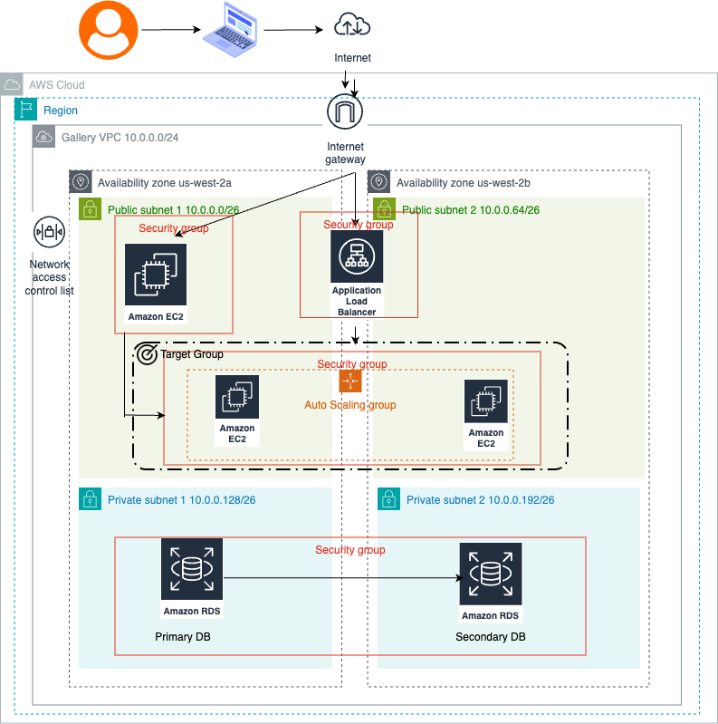

**THE SP GALLERY**

**Project Title and Description**
Our project name is the SP gallery

The goal of this project is to deploy a fault-tolerant, scalable and secure WordPress blog on AWS using Terraform.

**Overview**
This project automates the deplyment of a highly available Wordpress website in AWS.The architecture includes:
- EC2 instances in an Auto Scaling Group - RDS MySQL database for backend storage
- Application Load Balancer for traffic distribution
- VPC with 2 availability zones for high availability
- security groups for controlled and secure access 

**Architecture**

**Diagram**


**Key Components**

***VPC***:
Multi-AZ setup with public and private subnets.

***Security Groups***:
Configured to restrict traffic and allow only essential access (SSH, http).

***Auto Scaling Group***:
Dynamically adjusts the number of EC2 instances dynamically based on traffic.

***Load Balancer***:
Routes HTTP traffic to EC2 instances to ensure high availability.

***RDS MySQL Database***:
MySQL database deployed in private subnets for secure backend storage. 

***EC2 Instances***:
Hosts Wordpress on Apache web servers, ensuring scalability via the Auto Scaling Group. 

**Features**

Here are the main functionalities of our project:

1. Automated Infrastructure Deployment
- Infrastructure as Code (IaC) using Terraform for versioned deployments. 

2. High availability
- Resources deployed across two availability zones to ensure fault-tolerance.

3. Auto-Scaling
- EC2 instances dynamically scale in and out based on application traffic, optimizing performance and costs. 

4. Load Balancing
- Application Load Balancer distributes incoming traffic to avoid that on server is overloaded. 

5. Secure Deployment
- Resources are secured using Security Groups and private subnets. 

**Installation Instructions**

**Prerequisites**
Terraform: (https://developer.hashicorp.com/terraform/tutorials/aws-get-started/install-cli)

AWS CLI: (https://docs.aws.amazon.com/cli/latest/userguide/getting-started-install.html)

AWS IAM Configuration: An IAM user with the appropriate permissions

SSH key pair: required for EC2 access.


**Usage**
1. Clone the repository
```
git clone https://github.com/pelny-bloom/Deham_Pelny.git
```
2. Initialize Terraform
```
terraform init
````
3. Review the Terraform plan
```
terrafom plan
```
4. Deploy the infrastructure
```
terraform apply --auto-approve
```


**Access the Setup:**
WordPress:
                Access via the Load Balancer DNS (output after deployment).
Database:
                Connected automatically to WordPress instances.

Notes
Ensure that your AWS account has sufficient service quotas for EC2, RDS, and other resources.
Terminate resources using terraform destroy to avoid unnecessary costs.